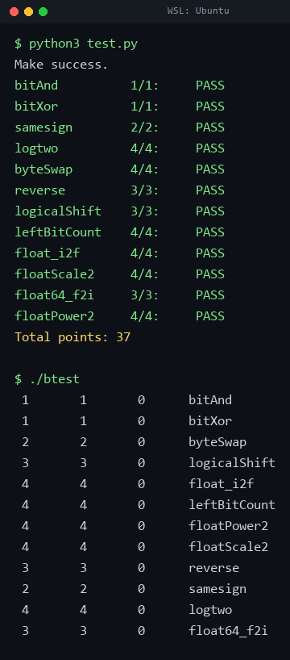

# datalab 报告

姓名：刘文淼

学号：2025201850

| 总分 | bitAnd | bitXor | samesign | logtwo | byteSwap | reverse | logicalShift | leftBitCount | float_i2f | floatScale2 | float64_f2i | floatPower2 |
| ------- | ------ | ------ | -------- | ------ | -------- | ------- | ------------ | ------------ | --------- | ----------- | ----------- | ----------- |
| **37/37** | 1/1 | 1/1 | 2/2 | 4/4 | 4/4 | 3/3 | 3/3 | 4/4 | 4/4 | 4/4 | 3/3 | 4/4 |

test 截图：`imgs/test.png`（`python3 test.py` 与 `./btest` 的实际输出）



## 解题报告

### 总览

第三讲讲的是「编码即取舍」：固定的位数是一块蛋糕，在范围、精度、代价之间切分。
DataLab 反过来做这件事——编码已经给定（补码、IEEE 754），
要求把语义重新"翻译"回位运算，而且只给一份残缺的运算符白名单。

做完 12 道题，我最深的体会是：**课件里那几套套路基本够用**。
"提取和拼装"管字段进出，"二分定位"管找最高位，"折半并行"管统计，
剩下的都是"符号处理 + 掩码"。难的不是想出新算法，
而是把已经会了的算法塞进运算符预算里。

下面按投入精力与满意程度展开三道题。

### 1. logtwo —— 二分定位，以及两个被禁用的零件

课件的经典例题「表示 X 最少要多少位」给出的正是这题的骨架：把"找最高位"翻译成二分——
先问高 16 位还有没有 1，有就把范围折半到那一半、并记下 16；再问 8、4、2、1，
五步锁定最高位，全程无循环、无比较。课件在那一页的注解是
"'找最高位 + 处理符号'全部翻译成位运算与二分"。

本题的困难在于白名单只剩 `> < >> << |`，课件写法里两个关键零件都不可用：

| 课件的写法 | 本题的限制 | 我的替换 |
| ------------------ | -------------- | -------- |
| `!!(x >> 16)` 把非零压成 1 | 逻辑非不在白名单 | `(v >> 16) > 0` |
| 用加号累加五段权重 | 加号不在白名单 | 按位或 |

第二步能成立，靠的是课件「提取和拼装」里那句**"前提是各段不重叠"**：
权重 16、8、4、2、1 两两无交集，按位或与加号完全等价。

这题我先后写了十余版，长期卡在 28 个运算符降不下来，一度以为上限写错了。
真正的突破口是**首段**：`r` 初值为 0，`r` 与 `b << 4` 相或时那个或运算是白送的，
写成直接赋值就省下一个，计数正好落到上限 25。

### 2. float64_f2i —— 移位之后还要再判一次越界

双精度的符号与阶码都在 `uf2` 的高 12 位。用"提取和拼装"把隐含的 1
与其后的 31 位尾数取出来凑成一个 32 位窗口 `val`，最高位就是那个隐含的 1；
于是整体右移 `1054-exp` 位，等价于把 53 位有效数字右移 `1075-exp` 位，
移出去的部分正是小数部分——**"向零取整"天然成立**，不需要额外判断。

难点不在拼装，而在边界。我最初的实现用 `exp > 1075` 判溢出，能过 `./btest`，
但另写随机对拍程序后发现两类错误：

| 输入 | 错误结果 | 正确结果 | 原因 |
| ------------------ | ------------ | ------------ | ------------------------ |
| `1e15`、`3e9` | 截断后的乱值 | `0x80000000` | 溢出判据的分界取错 |
| `-2147483649.0` | `2147483647` | `0x80000000` | **负数的取负符号回绕** |

第二类最隐蔽：`val` 本身没越界，但取负前它已超出 `INT_MAX`，一取负就翻成正数。
修正后的判据是在移位**之后**再检查一次 `val`：

```c
if (sign) { if (val > 0x80000000) return 0x80000000; return -val; }
else      { if (val > 0x7FFFFFFF) return 0x80000000; return val; }
```

### 3. logicalShift —— 绕开一个未定义行为

`x >> n` 对负数是算术右移、高位补符号位，所以要再与一个
"低 `32-n` 位全 1、高 `n` 位全 0"的掩码相与。本题禁用了 `unsigned`、`if`、
`while` 和减号，**而 `n = 0` 时 `1 << 32` 是未定义行为**，题目也明确禁止利用它。

解法是把一次移位拆成两步，让两个移位量都落在 `[0,31]`：

```c
mask = ((1 << (32 + ~n)) << 1) + ~0;   /* ~n == -n-1，故 32+~n 实为 31-n */
```

- `n = 0`：先得 `1<<31`（移位量 31 合法，只是落进符号位），左移一位变 0，
  加上课件技巧表里的"全 1 掩码" `~0` 恰好得到全 1
- `n >= 1`：`1 << (31-n)` 是正数，左移一位恰为 `1 << (32-n)`

### 其他函数

**`bitAnd`**：德摩根律 `a & b == ~(~a | ~b)`。

**`bitXor`**：先用 `~(~x & ~y)` 造出 `x|y`，再与 `~(x & y)` 相与，挖掉两者同为 1 的位。

**`samesign`**：0 既非正也非负，故分三类。都为 0 返回 1，恰有一个为 0 返回 0，
其余把符号位算术右移 31 位复制满整个字（课件的"符号扩展"）后比较。
注意本题只允许 `&&`，不允许 `||`。

**`byteSwap`**：课件「提取和拼装」的标准用法——`(x >> (p<<3)) & 0xFF` 提取第 p 字节，
先把两个原字节位置清零再交换放回，保证拼装时各段不重叠。

**`reverse`**：循环 32 次，每轮把结果左移一位腾出最低位，再填入 `v` 的最低位。

**`leftBitCount`**：与课件 bitCount 的"折半并行求和"同源，只是方向相反——
那边自底向上把相邻位两两合并，这边自顶向下分段确认。两个坑：
一是 `x` 有符号，算术右移会把符号位复制出来，取出该段后必须再与掩码相与，
否则 `(x >> 16)` 对负数得 `0xFFFFFFFF`，比较恒不成立；
二是本题没有 `==`、`*`、`-`，判等改用 `!(a ^ b)`，乘步长改用左移，
移位量 `32-c-s` 用 `25+~c`、`29+~c`、`31+~c`、`32+~c` 这类等价形式表达。

**`float_i2f`**：撞上课件说的"补码著名的坑"：`-INT_MIN == INT_MIN`。
把幅值交给 `unsigned` 变量承载后，这个坑反而不用单独处理，
取负得到的位模式就是 `0x80000000`，正是所需幅值。阶码由最高位下标决定，
舍入用课件的"偶数舍入"（逢半取偶）。

**`floatScale2`**：按课件的"阶码分区"分四类。**阶码为 254 时不能直接加 `0x00800000`**——
那会把阶码推到 255 而尾数非零，得到非法位模式；正确结果是无穷，必须单独返回。

**`floatPower2`**：四段分支——下溢返回 0、非规格化数用 `1 << (x+149)`、
上溢返回正无穷、其余按移码 `x + 127` 填阶码字段。

## 反馈/收获/感悟/总结

**耗时**：约 10 小时，其中 `logtwo` 一个函数占了一半以上。

**第一点体会是"测试通过不等于正确"。** 我的 `floatScale2` 与 `float64_f2i`
起初都能通过 `./btest`，是后来另写了随机对拍程序（用 C 原生运算和 `tests.c`
的参考实现当基准，跑了五百多万组）才暴露出边界缺陷。官方测试也是在对拍，
但覆盖面有限；自己动手构造对照，往往能发现标准测试漏掉的情形。

**第二点体会是"约束越紧，越要回头质疑自己的前提"。** `logtwo` 卡在 28 个运算符时，
我的第一反应是继续压缩，甚至怀疑题目上限写错了。真正的突破口是重新审视两处假设：
按位或与加号在权重不重叠时等价，以及负数该返回 0 而不是 31。
**在动手改代码之前，先把"我凭什么认为这是对的"想清楚，比多写十版实现更有效。**

**第三点体会来自一个反面教训：自建的验证工具同样需要被验证。**
我的复核程序一度把 `logtwo` 的基准写成"前导零计数"，于是对正确的实现误报了
15 万条失败。当时若轻信它，就会把已经正确的代码改坏。后来改为一字不差地照抄
`tests.c` 的基准，并同时用官方测试与题目原文三方对照，误报才归零。

**还有一处纯粹的踩坑**：本题的评测脚本**禁止类型转换**。
我本想把 `float_i2f` 里 `-x` 换成更严谨的 `-(unsigned)x`，
结果直接判 `Using type conversion` 而丢分。可见这类细节必须以评测脚本为准，
不能只按语言标准的直觉行事。

## 参考的重要资料

1. 课程课件《从 0/1 出发编码万物》（第三讲）—— 补码的"负阴抱阳"、
   浮点的"致广大而尽精微"、"提取和拼装"、"五个必背公式"、
   bitCount 的"折半并行求和"与例题的"二分定位"，本报告的思路基本都来自这里。
2. 《深入理解计算机系统》（CSAPP）第 2 章 —— 整数与浮点的位级表示、舍入规则。
3. *Hacker's Delight*（Henry S. Warren）—— 位运算与二分定位的常用模式。
4. 仓库 `tests.c` 中的参考实现 —— 我把它当作独立基准用于随机对拍，
   并据此定位了 `float64_f2i` 的指数分界（应为 1023 / 1054）写错的问题，
   以及 `logtwo` 对负数的处理规则。
5. 课程 `Lab0.pdf` 与仓库 `README.md`、`report/README.md` —— 环境与提交规范。
