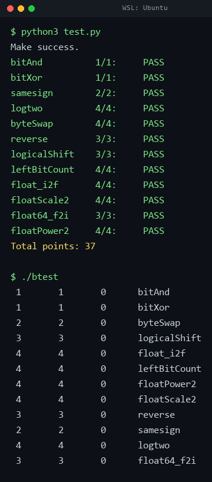

# datalab 报告

姓名：刘文淼

学号：2025201850

| 总分 | bitAnd | bitXor | samesign | logtwo | byteSwap | reverse | logicalShift | leftBitCount | float_i2f | floatScale2 | float64_f2i | floatPower2 |
| ------- | ------ | ------ | -------- | ------ | -------- | ------- | ------------ | ------------ | --------- | ----------- | ----------- | ----------- |
| **37/37** | 1/1 | 1/1 | 2/2 | 4/4 | 4/4 | 3/3 | 3/3 | 4/4 | 4/4 | 4/4 | 3/3 | 4/4 |

test 截图：`imgs/test.png`（`python3 test.py` 和 `./btest` 的实际输出）



## 解题报告

12 道做下来感觉最别扭的是能用的符号太少。比如 `logtwo` 只给 `> < >> << |` 五个，
连 `!` 和 `+` 都没有。差不多每道题都得先把想写的写法翻译成白名单里有的，
翻完再去愁怎么把运算符个数压下来。

花时间最多的是 `logtwo`，`float64_f2i` 和 `logicalShift` 也折腾了一阵，
下面主要写这三道，剩下的在后面简单说一下。

### 1. logtwo

思路是从课件那道「表示 X 最少要多少位」的例题来的。那道例题就是把找最高位
翻译成二分：先看高 16 位有没有 1，有就把范围缩到那一半、记下 16，
然后 8、4、2、1 这么下去，五步就够了。

但课件的写法有两个地方用不了：

| 课件的写法 | 本题没有 | 我换成 |
| ------------------ | -------- | -------- |
| `!!(x >> 16)` 判断非零 | 没有 `!` | `(v >> 16) > 0` |
| 用 `+` 把几段权重加起来 | 没有 `+` | 用按位或 |

第一个直接换就行。第二个卡了我一会儿，后来想到那五段权重 16、8、4、2、1
是互相不重叠的，那按位或和加法结果一样，所以能用 `|`。
课件讲提取和拼装那里好像提过一句「前提是各段不重叠」，
我当时没在意，做这题才用上。

然后就是运算符个数。我写了十几版，一直卡在 28，差 3 个，怎么删都删不下去，
中间还怀疑过是不是题目上限写错了。最后是在第一行找到的：
`r` 一开始就是 0，那 `r |= b << 4` 里的 `|` 其实没起作用，
直接写 `r = b << 4` 就少一个。改完刚好 25。

### 2. float64_f2i

符号和阶码都在 `uf2` 的高 12 位。先把隐含的 1 和它后面的 31 位尾数取出来，
拼成一个 32 位的 `val`，最高位就是那个隐含的 1；然后整体右移 `1054-exp` 位，
等于把 53 位有效数字右移 `1075-exp` 位，小数部分自然被移掉，向零取整就是了。

问题在边界。我一开始用 `exp > 1075` 判溢出，`./btest` 是能过的，
后来拿几个极端值代进去算，发现有错：

| 输入 | 我算出来 | 应该是 | 原因 |
| ------------------ | ------------ | ------------ | ------------------------ |
| `1e15`、`3e9` | 乱值 | `0x80000000` | 分界取错了 |
| `-2147483649.0` | `2147483647` | `0x80000000` | 负数取负之后符号回绕 |

第二个比较隐蔽。`val` 本身没越界，但它已经超过 `INT_MAX` 了，一取负就翻成正数。
改法是在移位之后再查一次：

```c
if (sign) { if (val > 0x80000000) return 0x80000000; return -val; }
else      { if (val > 0x7FFFFFFF) return 0x80000000; return val; }
```

### 3. logicalShift

负数右移是算术右移，高位补符号位，所以得再与一个「低 32-n 位全 1、高 n 位全 0」
的掩码。题目禁了 `unsigned`、`if`、`while` 和减号，麻烦的是 `n = 0` 时
`1 << 32` 是未定义行为，题目也说了不准用 UB。

最后的写法是把一次移位拆成两次，让两个移位量都在 `[0,31]`：

```c
mask = ((1 << (32 + ~n)) << 1) + ~0;   /* ~n == -n-1，所以 32+~n 其实是 31-n */
```

- `n = 0`：先得到 `1<<31`（移位量 31 本身合法，只是结果落进了符号位），
  再左移一位变成 0，加上 `~0` 正好是全 1
- `n >= 1`：`1 << (31-n)` 是正数，左移一位就是 `1 << (32-n)`

思路是先把 `32-n` 换成 `32 + ~n`，这样移位量肯定不越界；
但换成这样会少一个 2 倍，所以后面又补了一次左移。

### 其他几个

**bitAnd**：德摩根律，`a & b == ~(~a | ~b)`。

**bitXor**：先造 `x|y`（就是 `~(~x & ~y)`），再和 `~(x & y)` 相与，把两位都是 1 的地方挖掉。

**samesign**：0 既不是正也不是负，得分三类写。都是 0 返回 1，只有一个 0 返回 0，
其余把符号位右移 31 位复制满整个字再比。这题只给 `&&` 没给 `||`，判断只能一层层串。

**byteSwap**：第 p 个字节就是 `(x >> (p<<3)) & 0xFF`。
先把两个原字节的位置清零，再错位放回去，这样拼的时候不会重叠。

**reverse**：循环 32 次，每轮把结果左移一位腾出最低位，把 `v` 的最低位填进去。

**leftBitCount**：和课件 bitCount 的思路一样，只是方向反过来，那边是自底向上合并，
这边是自顶向下分段确认。两个地方要注意：一是 `x` 有符号，算术右移会把符号位
复制出来，取完那一段必须再与掩码相与，不然 `(x >> 16)` 对负数是 `0xFFFFFFFF`，
和全 1 的比较永远不成立；二是这题没有 `==`、`*`、`-`，判等要写成 `!(a ^ b)`，
乘步长用左移，移位量 `32-c-s` 写成 `25+~c`、`29+~c` 这种形式，
这几个常数我一个个验算过。

**float_i2f**：撞上课件说的 `-INT_MIN == INT_MIN` 那个坑。把幅值放进 `unsigned`
之后这个坑就不用单独处理了，取负出来的位模式就是 `0x80000000`。
阶码看最高位下标，舍入用的逢半取偶。

**floatScale2**：按阶码分四类。有个坑是阶码 254 的时候不能直接加 `0x00800000`，
那会把阶码推到 255 但尾数还有值，变成非法位模式，正确结果应该返回无穷。

**floatPower2**：分四段，下溢返回 0，非规格化数用 `1 << (x+149)`，
上溢返回正无穷，其余按移码 `x + 127` 填阶码。

## 反馈/收获/感悟/总结

光 `logtwo` 一个就占了大半时间。

之前一直觉得 `./btest` 全过就没问题了，后来发现不是。我的 `floatScale2` 和
`float64_f2i` 最开始都能过 `./btest`，是自己挑特殊值挨个代进去算才发现边界不对。
`./btest` 用的是一组固定的测试数据，像阶码 254、指数刚好卡在分界这种地方它就覆盖不到。

`logtwo` 卡在 28 个运算符的时候，我第一反应是继续压，压不下去就开始怀疑题目。
后来发现该做的是回头查前提：按位或到底能不能替加号，负数到底该返回什么。
这两个想清楚之后，改代码只花了两分钟。之前那十几版基本都是在瞎试。

还有一个是评测脚本不允许显式类型转换。我本来想把 `float_i2f` 里的 `-x`
换成 `-(unsigned)x`，看着更严谨，结果被判 `Using type conversion` 丢分。
还是得看评测脚本，光按语言标准的直觉走不一定行。

## 参考的重要资料

1. 课程课件《从 0/1 出发编码万物》（第三讲）。补码的「负阴抱阳」、浮点的
   「致广大而尽精微」、提取和拼装、五个必背公式，还有 bitCount 的折半并行求和，
   基本都是照着这一讲做的。
2. 《深入理解计算机系统》（CSAPP）第 2 章，整数和浮点的位级表示。
3. 仓库 `tests.c` 里的参考实现。题目描述不确定的地方（比如 `logtwo` 遇到
   0 和负数该怎么返回），我是对着它确认的。
